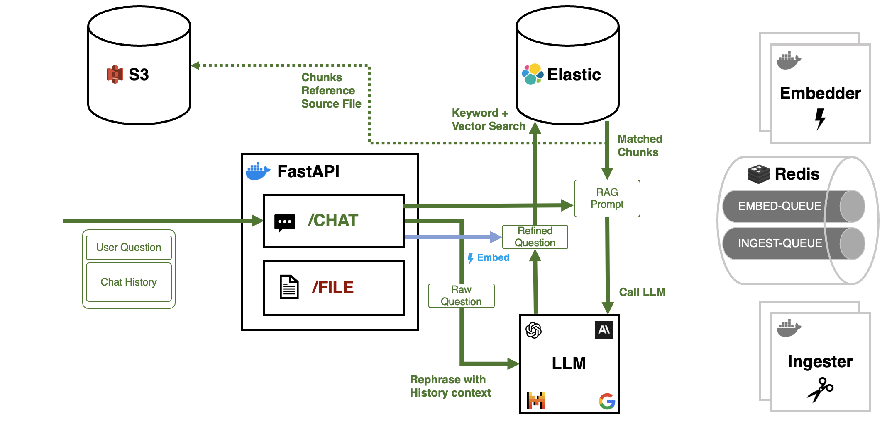

# Architecture

Redbox is intended to be as modular and multi-use as possible. Our initial design is build for AWS simply due to the cloud available to us. However, we are designing the system to be able to be used on any cloud provider or on-premises.

Some of our guiding architectural principles are:

- **Modularity**: We want to be able to swap out components easily. This means that we want to be able to swap out the database, the document processing pipeline, the large language model, etc.
- **Scalability**: We want to be able to scale the system horizontally. This means that we want to be able to add more instances of the system to handle more load.
- **Resilience**: We want the system to be able to recover from failures. This means that we want to be able to recover from a failure of a single instance of the system.
- **Security**: We want the system to be secure. This means that we want to be able to secure the system from unauthorized access.
- **Simplicity**: In taking a simple approach to data ownership we want to enable other deployers to introduce their own business logic separately from the core system.

## Document Processing Pipeline

The document processing pipeline is the core of the Redbox system. It is responsible for processing documents and extracting information from them. The pipeline is broken down into three main components: Ingester, Embedder, and Core API.

## RAG Architecture

The Retrieval Augmented Generation (RAG) architecture grounds our Large Language Model in the context of uploaded documents. 

## Notional Cross-Cloud Components

| Component | AWS | Azure | Local | Purpose/Function |
|-----------|-----|-------|---------|----|
| Object Store | S3 | Blob Storage | Minio | Storage of files |
| Queue | SQS | Storage Queues | Redis | Distributing many compute tasks |
| Frontend App | ECS | App Service | Docker | NextJS Chat App |
| Core API | ECS | App Service | Docker | FastAPI AI Interaction and DB Intermediary |
| Ingester Worker | ECS | App Service | Docker | Queue fed file ingester |
| Embedder Worker | ECS | App Service | Docker | Queue fed chunk embedder |
| Document Database | DynamoDB | CosmosDB | PostGres | Conversation and Doc storage |
| Vector Database | ElasticCloud | ElasticCloud | Elasticsearch | RAG Database |
| Container Registry | ECR | ACR | Harbor | Storage for app containers |
| Embedding API | Bedrock | Azure OpenAI Service | Huggingface Containers | Embedding for docs into VectorDB |
| LLM API | Bedrock | Azure OpenAI Service | Huggingface Containers | Chat model |
| Authentication | Cognito | Entra | NONE | User auth and management |
