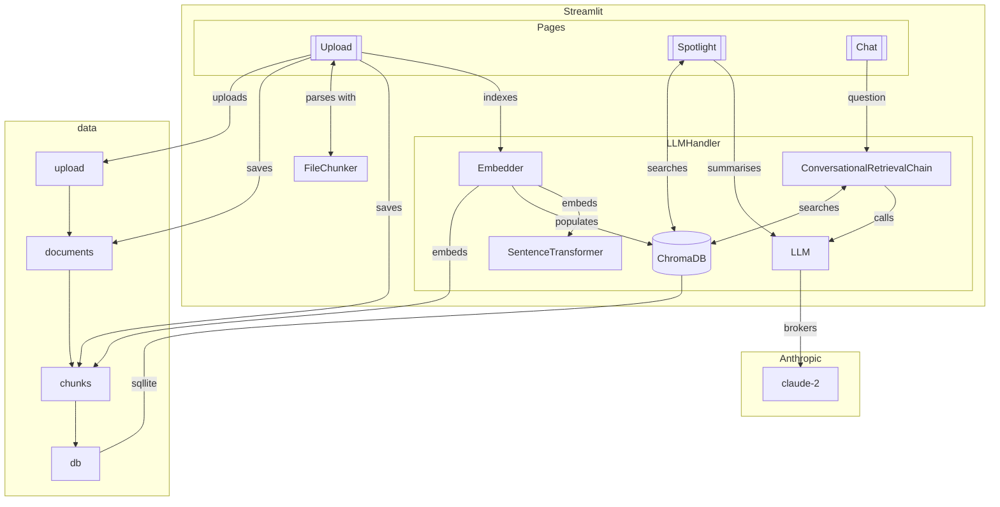

# MVP Architecture

```mermaid
flowchart TD;
    subgraph Streamlit
        subgraph Pages
            upload_page[[Upload]]
            spotlight_page[[Spotlight]]
            chat_page[[Chat]]
        end

        subgraph LLMHandler
            vectordb[(ChromaDB)]
            Embedder
            SentenceTransformer
            ConversationalRetrievalChain
            LLM
        end

        subgraph FileChunker

        end
        
        
    end
    subgraph data
        upload
        documents
        chunks
        db
    end

    subgraph Anthropic
        claude-2
    end

    upload --> documents
    documents --> chunks
    chunks --> db

    upload_page -->|uploads| upload
    upload_page -->|saves| documents
    upload_page <-->|parses with| FileChunker
    upload_page -->|saves| chunks
    upload_page -->|indexes| Embedder
    
    Embedder -->|embeds| chunks
    Embedder -->|populates| vectordb
    Embedder -->|embeds| SentenceTransformer

    vectordb ---|sqllite| db

    ConversationalRetrievalChain <-->|searches| vectordb
    ConversationalRetrievalChain -->|calls| LLM

    LLM -->|brokers| claude-2

    chat_page -->|question| ConversationalRetrievalChain
    
    spotlight_page <-->|searches| vectordb
    spotlight_page -->|summarises| LLM

    

```