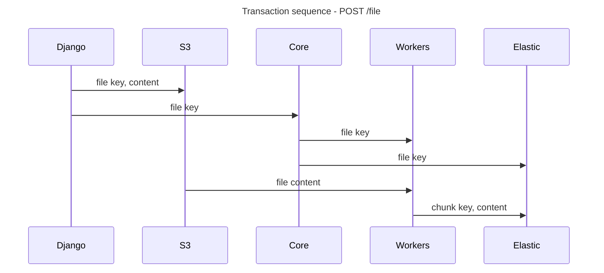
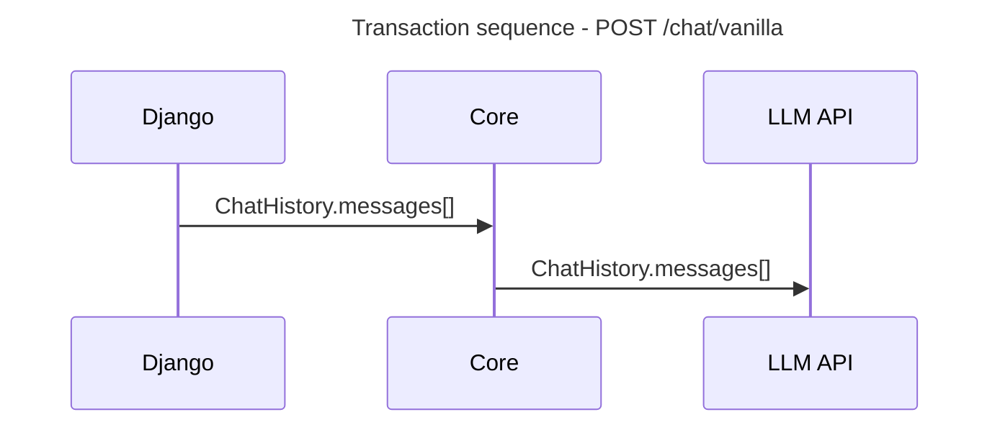
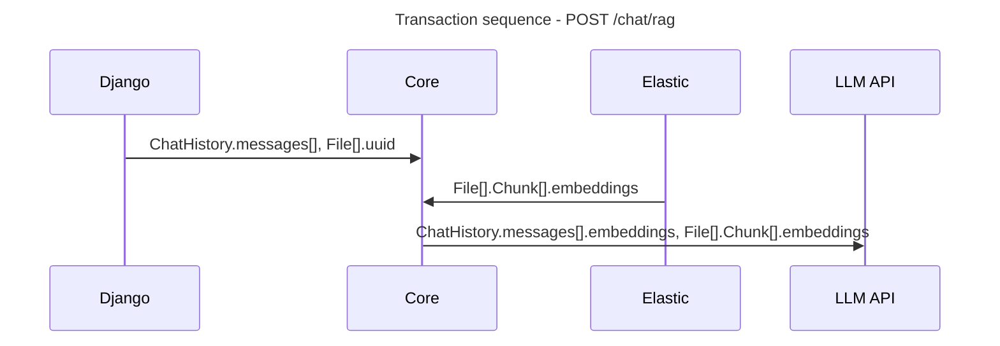
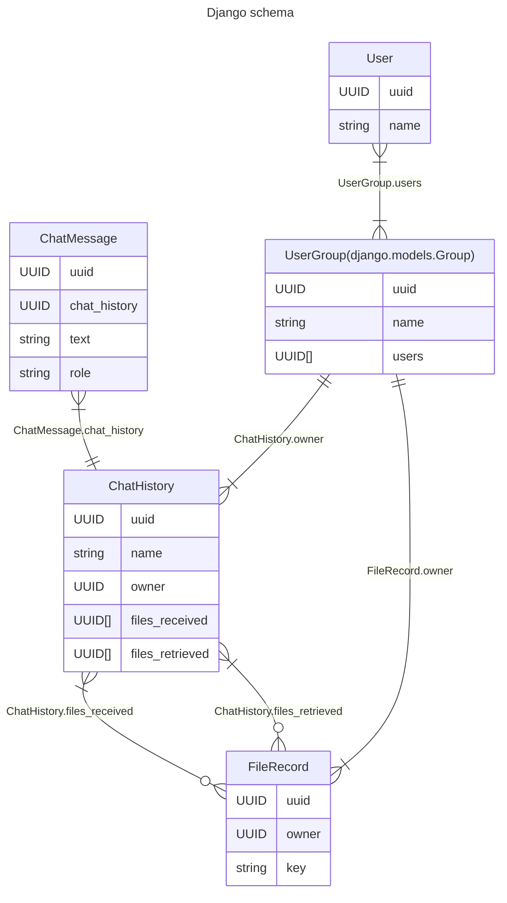
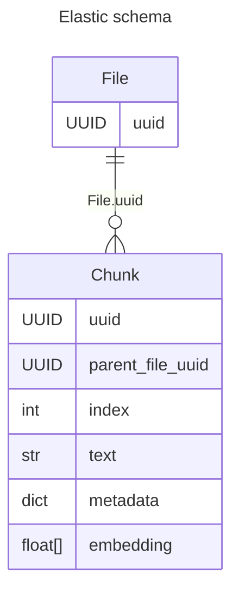

# Transactions and Schema
## Transaction Sequences

Below are the transaction sequences for the APIs. The transaction sequences are generated using the [mermaid](https://mermaid-js.github.io/mermaid/#/) library. 
### File APIs

See below for some of the main [`File`](../code_reference/models/file.md) routes.

#### `POST /file`

### Chat APIs

#### `POST /chat/vanilla`

#### `POST /chat/rag`

## Schema

### Django Schema

The Django schema is a simple schema that stores the users, user groups, chat messages, chat histories, and file records. We keep all the business logic isolated here to keep the Core API simple. For any organisations with more complex business logic, this is where you would add it in your own version.

### Elastic Schema

Keeping things simple is the primary ethos here. We are storing the UUID of the parent file in the chunk. This allows us to easily query for all chunks of a file. We are also storing the text of the chunk, the metadata of the chunk, and the embedding of the chunk. The embedding is a float array that is generated by the embedding API.

