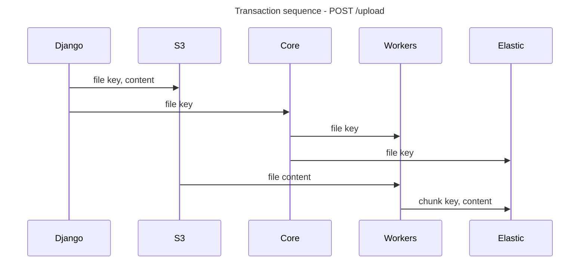
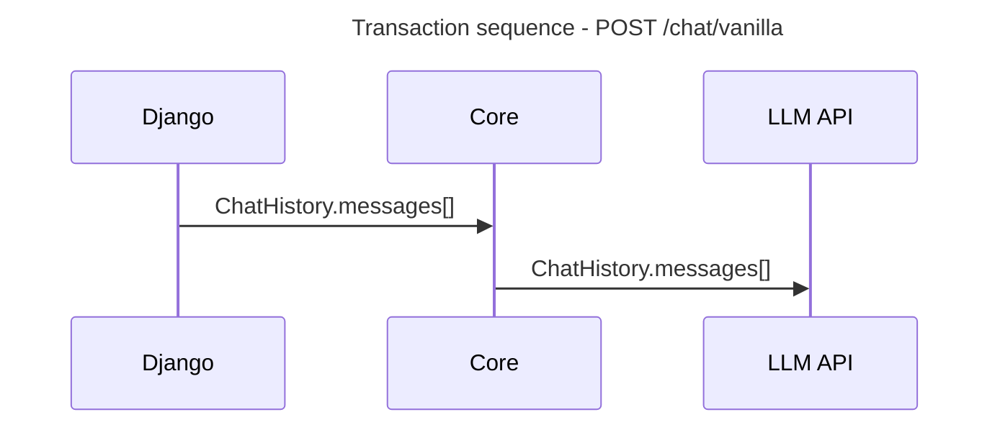
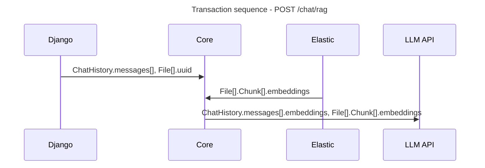
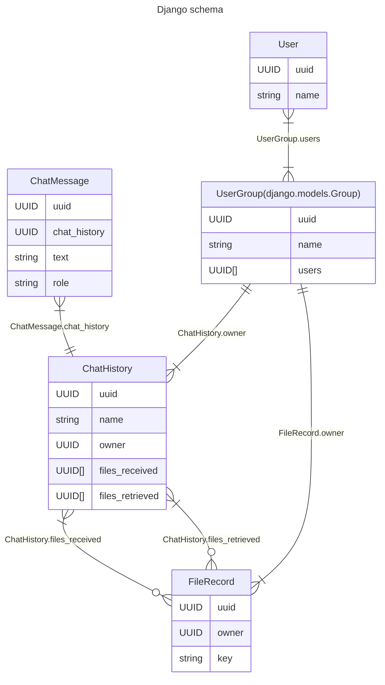
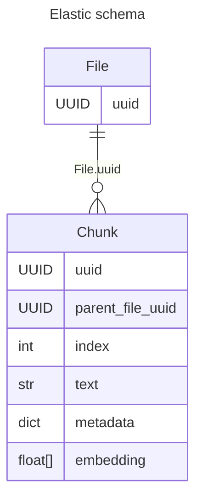

# Transaction and schema diagrams
## Transaction Sequences
### File apis

```mermaid
---
title: Transaction sequence - POST /upload
---

sequenceDiagram
    Django->>S3: file key, content
    Django->>Core: file key
    Core->>Workers: file key
    Core->>Elastic: file key
    S3->>Workers: file content
    Workers->>Elastic: chunk key, content
```

### Chat APIs

```mermaid
---
title: Transaction sequence - POST /chat/vanilla
---

sequenceDiagram
    Django->>Core: ChatHistory.messages[]
    Core->>LLM API: ChatHistory.messages[]

```

```mermaid
---
title: Transaction sequence - POST /chat/rag
---

sequenceDiagram
    Django->> Core: ChatHistory.messages[], File[].uuid
    Elastic->>Core: File[].Chunk[].embeddings
    Core->>LLM API: ChatHistory.messages[].embeddings, File[].Chunk[].embeddings

```

## Schema

```mermaid
---
title: Django schema
---

erDiagram
    User }|--|{ "UserGroup(django.models.Group)" : "UserGroup.users"
    User {
        UUID uuid
        string name
    }
    "UserGroup(django.models.Group)" {
        UUID uuid
        string name
        UUID[] users
    }
    
    FileRecord }|--|| "UserGroup(django.models.Group)": "FileRecord.owner"
    FileRecord {
        UUID uuid
        UUID owner
        string key 
    }

    ChatMessage {
        UUID uuid
        UUID chat_history
        string text
        string role 
    }

    ChatMessage }|--|| ChatHistory: "ChatMessage.chat_history"
    "UserGroup(django.models.Group)" ||--|{ ChatHistory: "ChatHistory.owner"

    ChatHistory {
        UUID uuid
        string name
        UUID owner
        UUID[] files_received
        UUID[] files_retrieved
    }

    ChatHistory }|--o{ FileRecord: "ChatHistory.files_received"
    ChatHistory }|--o{ FileRecord: "ChatHistory.files_retrieved"
```

```mermaid
---
title: Elastic schema
---

erDiagram
    File ||--o{ Chunk : "File.uuid"
    File {
        UUID uuid
    }
    Chunk {
        UUID uuid
        UUID parent_file_uuid
        int index
        str text
        dict metadata
        float[] embedding
    }
```
