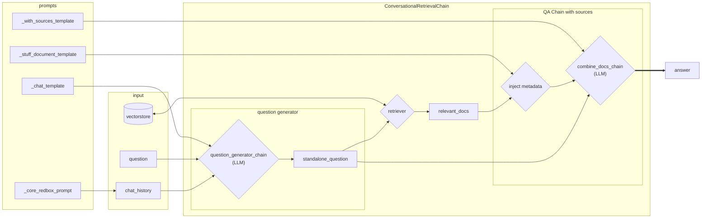

# Chat chain diagram

 #
 Based on langchain class: `ConversationalRetrievalChain(BaseConversationalRetrievalChain)`:

"This chain takes in chat history (a list of messages) and new questions, and then returns an answer to that question.    The algorithm for this chain consists of three parts:

1. Use the chat history and the new question to create a "standalone question". This is done so that this question can be passed into the retrieval step to fetch   relevant documents. If only the new question was passed in, then relevant context      may be lacking. If the whole conversation was passed into retrieval, there may    be unnecessary information there that would distract from retrieval.

2. This new question is passed to the retriever and relevant documents are  returned.

3. The retrieved documents are passed to an LLM along with either the new question    (default behavior) or the original question and chat history to generate a final    response."
