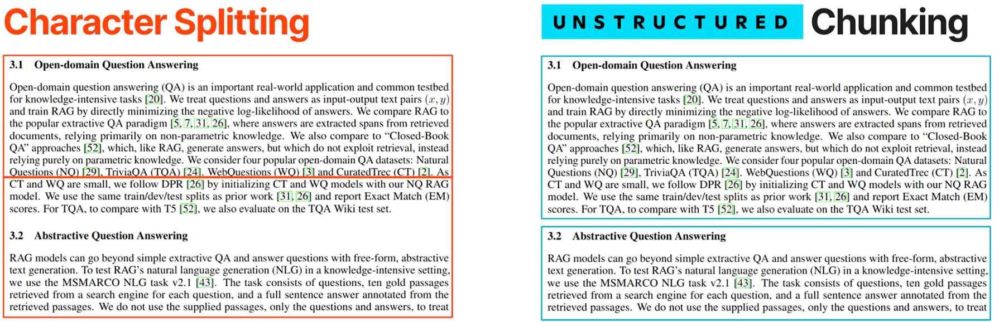

# Chunkers

In redbox, we want to have multiple chunking strategies available to us. This is because different types of files may require different chunking strategies. For example, a text file can be chunked by line, paragraph, or sentence. A PDF file can be chunked by page, paragraph, or sentence.

By default, we have implemented one universal chunker using the [unstructured library's `by_title` strategy](https://unstructured-io.github.io/unstructured/core/chunking.html#by-title-chunking-strategy). This preserves the structure of the document by chunking it based structural elements like headings and subheadings.

#### Example of chunking by title:

::: redbox.parsing.chunkers.other_chunker
