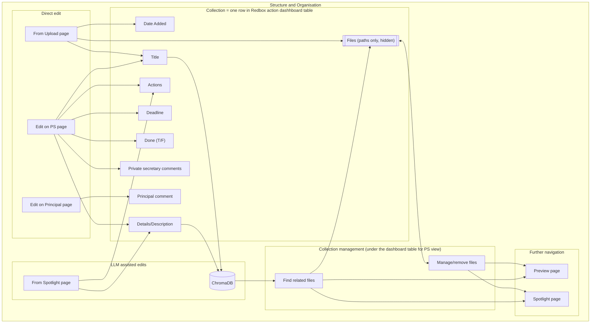

# Structure and organisation

```mermaid
flowchart TD;
    subgraph Structure and Organisation

            subgraph "Collection = one row in Redbox action dashhboard table"
                date[Date Added]
                title[Title]
                files[["Files (paths only, hidden)"]]
                details[Details/Description]
                deadline[Deadline]
                actions[Actions]
                comment_ps[Private secretary comments]
                comment_p[Principal comment]
                done["Done (T/F)"]
            end

            subgraph "Collection management (under the dashboard table for PS view)"
                manage[Manage/remove files]
                add[Find related files]


            end

            subgraph LLM assisted edits
                similar[(ChromaDB)]
                spotlight[From Spotlight page]
        end


        subgraph Further navigation
            spotlight_page[Spotlight page]
            preview_page[Preview page]

        end


            manage --> preview_page
            manage --> spotlight_page
            add --> preview_page
            add --> spotlight_page

            %% deadline --> spotlight_page
            files <--> manage

            add --> files


        subgraph Direct edit
                upload[From Upload page]
                edit_ps["""Edit on PS page"""]
                edit_p["""Edit on Principal page"""]

        end


        upload --> date
        upload --> title
        upload --> files
        title --> similar
        details --> similar
        similar --> add
        spotlight --> actions
        spotlight --> details
        edit_ps --> title
        edit_ps --> details
        edit_ps --> deadline
        edit_ps --> actions
        edit_ps --> done
        edit_ps --> comment_ps
        edit_p --> comment_p

    end
```
