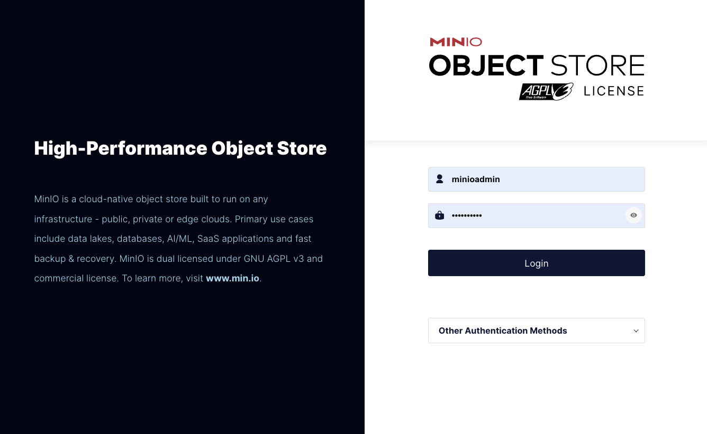
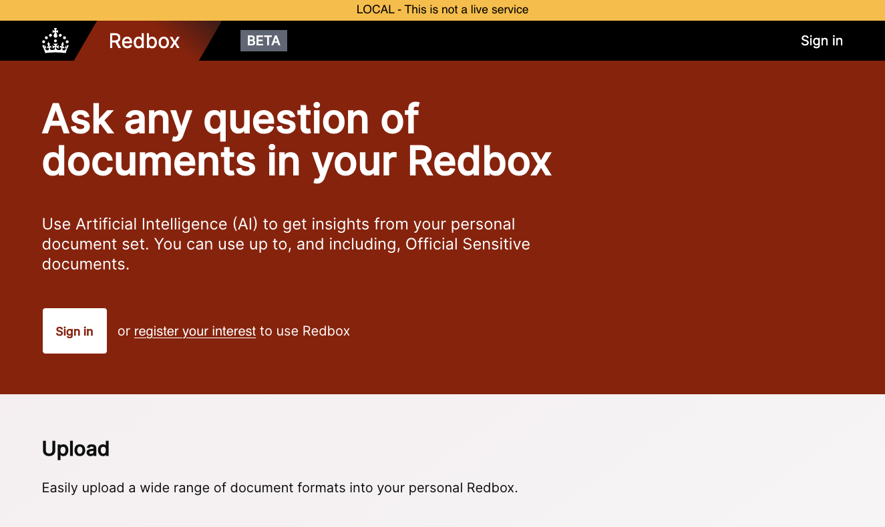
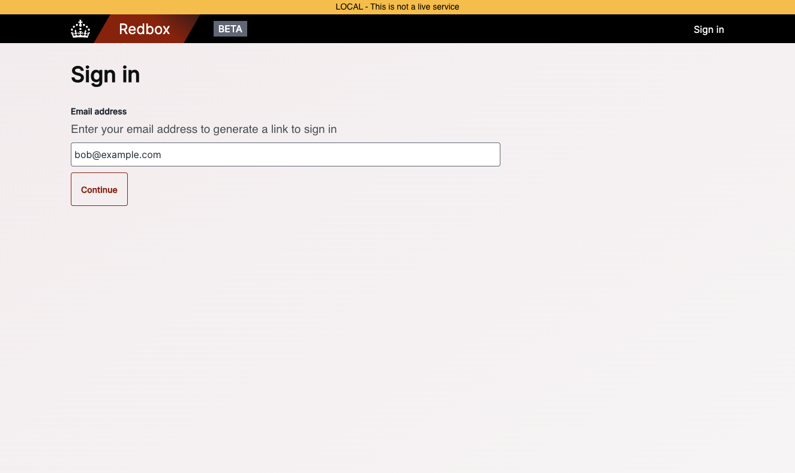
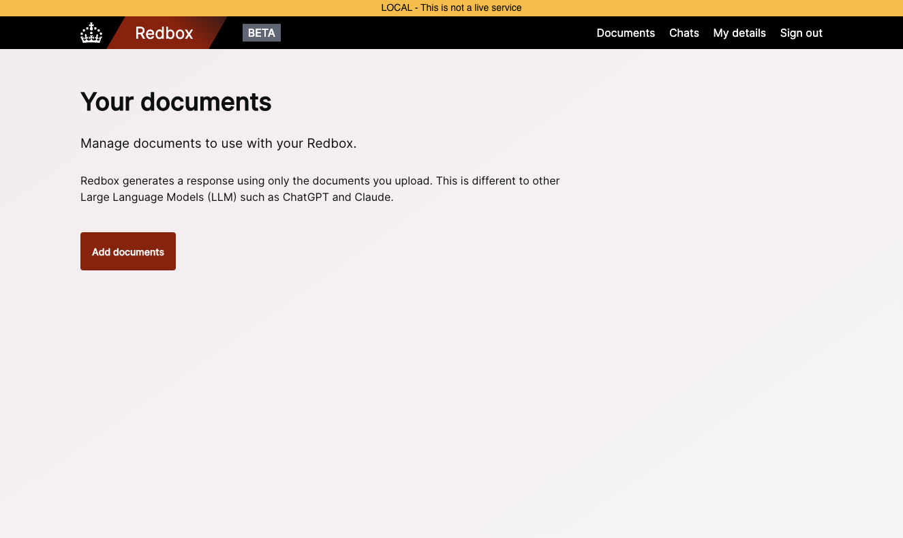
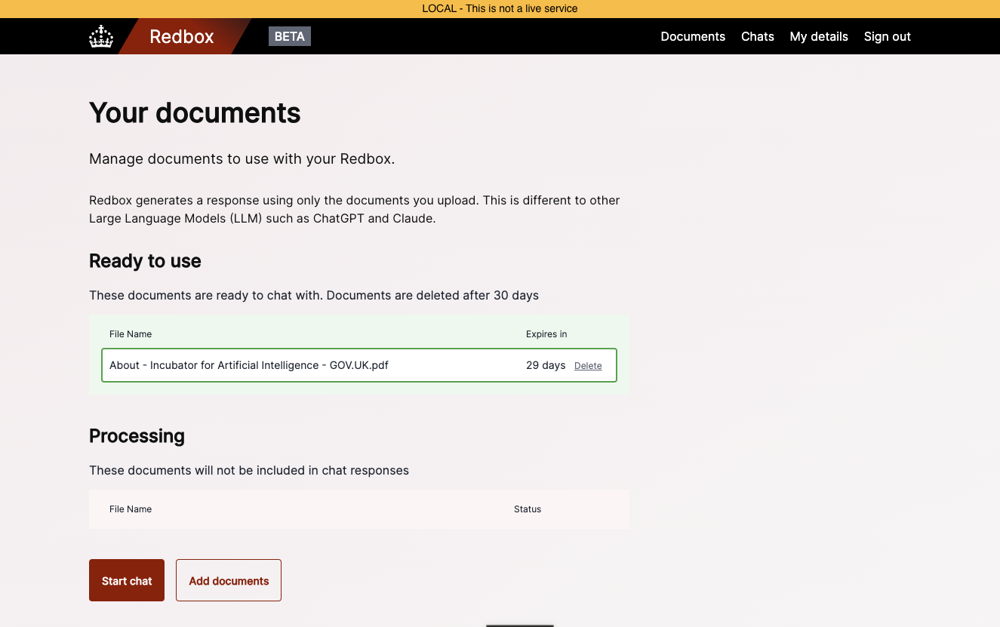
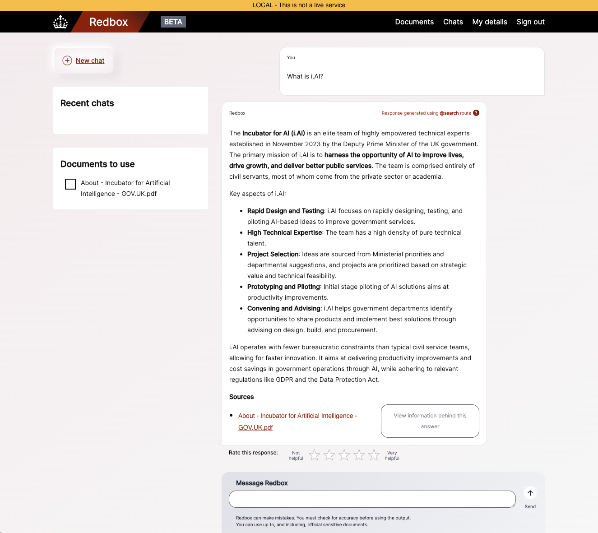

# Local Development/Deployment

This guide will help you set up the project for local development and the simplest deployment for Redbox. For the initial steps, please refer to the [installation guide](../installation/index.md). That guide will help you set up the project and install the necessary dependencies for this guide.

## Step 5: **Running the project**

To run the project locally make sure you're in the root directory of the repo, then you can use the following command:

```bash
make run
```

or 

```bash
docker compose up -d
```

As the project deploys, you should eventually see the following message:

```
[+] Running 8/8
 ✔ Network redbox_redbox-app-network  Created                                                                       0.0s 
 ✔ Container redbox-elasticsearch-1   Healthy                                                                      22.7s 
 ✔ Container redbox-redis-1           Healthy                                                                      22.7s 
 ✔ Container redbox-minio-1           Healthy                                                                      22.7s 
 ✔ Container redbox-db-1              Healthy                                                                      22.7s 
 ✔ Container redbox-worker-1          Healthy                                                                      22.7s 
 ✔ Container redbox-core-api-1        Healthy                                                                      22.6s 
 ✔ Container redbox-django-app-1      Healthy                                                                      32.6s 
```

Redbox utilises health checks to ensure that the services are running correctly.

## Step 6: **Setting up MinIO**

MinIO is an object storage server that is compatible with Amazon S3. It is used to store the documents that are used by the application. To set up MinIO, you can navigate to [`http://localhost:9001`](http://localhost:9001) in your browser. You should see the following screen:



The default credentials are:

- Username: `minioadmin`
- Password: `minioadmin`

Once logged in, you need to create a bucket by clicking on the `Buckets` tab on the left of the screen and clicking `Create Bucket +`. You can name the bucket `redbox-storage-dev` and leave the rest of the settings as default.

!!! warning "Important"
    The bucket name must be `redbox-storage-dev` or the application will not work correctly.

For debugging, you can now access [`http://localhost:9001/buckets/redbox-storage-dev/admin/summary`](http://localhost:9001/buckets/redbox-storage-dev/admin/summary) to see the contents of the bucket and inspect files.

## Step 7: **Accessing the application**

Once the project is running, you can access the application by navigating to [`http://localhost:8090`](http://localhost:8090) in your browser. You should see the following screen:



## Step 8: **Setting up Django Admin**

To create an admin user, you can run the following command:

```bash
docker compose run django-app venv/bin/django-admin createsuperuser
```

You will be prompted to enter an email and a password. These can be anything you like as the development mode doesn't send emails or use passwords for authentication. Instead we use magic links. Once the superuser is created, you can log in to the Django admin interface by navigating to [`http://localhost:8090/sign-in`](http://localhost:8090/sign-in) and entering the email you just created.



After entering the email, you will be prompted to press "Continue". Once you do this, you can navigate to your terminal and run the following command:

```
docker compose logs django-app | grep 8090/magic_link
```

This command will output a URL that you can click on to log in to the Django admin interface.

```
django-app-1  | http://localhost:8090/magic_link/5f6a67a2-dcf4-4bbb-8b00-817294d1f251/
```

## Step 9: **Uploading a File*

Once you're logged in, you will see a screen for collecting details about the user. This is currently geared towards Civil Service users, but you skip this step by clicking the "Skip" button. You will then be taken to the main page of the application.



From here you can [upload documents](http://localhost:8090/upload/) to be added to the system and view the documents that are already in the system.



In a few moments, you should see the document you uploaded turn green as completed. There is an embedding stage that can take some time based on the size of the document and the capacity of your embedding model. 

## Step 10: **Chat with the document**

Once the document is processed, you can click on the [Chats](http://localhost:8090/chats/) tab to see the document and chat with it.



You can ask questions about the document and the system will try to answer them based on the content of the document.

## Step 11: **Acessing the Admin Interface**

You can access the admin interface by navigating to [`http://localhost:8090/admin`](http://localhost:8090/admin) and logging in with the superuser you created earlier. Here you can manage users, documents, chat histories and other parts of the system.

## Step 12: **Shutting down the project**

To shut down the project, you can run the following command:

```bash
docker compose down
```

This will stop all the services and remove the containers. If you want to remove the volumes as well, you can run:

```bash
docker compose down -v
```