# Production Architecture

| Component | AWS | Azure | Local | Purpose/Function |
|-----------|-----|-------|---------|----|
| Object Store | S3 | Blob Storage | Minio | Storage of files |
| Queue | SQS | Storage Queues | RabbitMQ | Distributing many compute tasks |
| Frontend App | ECS | App Service | Docker | NextJS Chat App |
| AI App | ECS | App Service | Docker | FastAPI AI Interaction and DB Intermediary |
| Ingest App | ECS | App Service | Docker | FastAPI Embedding Handling |
| Embedding App | ECS | App Service | Docker | FastAPI File processing |
| Document Database | DynamoDB | CosmosDB | PostGres | Conversation and Doc storage |
| Vector Database | ??? | Cognitive Search | Weaviate | RAG Database |
| Container Registry | ECR | ACR | Harbor | Storage for app containers |
| Embedding API | Bedrock | Azure OpenAI Service | Huggingface Containers | Embedding for docs into VectorDB |
| LLM API | Bedrock | Azure OpenAI Service | Huggingface Containers | Chat model |
| Authentication | Cognito | Entra | ??? | User auth and management |

```mermaid
flowchart TD;
    subgraph apps[Apps]
        subgraph frontend_app[Frontend App]
            upload_page[Upload Page]
            spotlight_page[Spotlight Page]
            chat_page[Chat Page]
            file_page[File Management]
            user_page[User Preferences]
        end

        subgraph ai_app[AI App]
            categorisation_func[Document Categorisation Function]
            summary_func[Document Summary Function]
            x_extract_func[Generic Extraction Function]
        end

        ingest_app[Ingest App]
        embedding_app[Embedding App]
    end

    subgraph document_db[Document Database]
        parsed_documents_index([Parsed Documents])
        chunks_index([Chunks])
        conversations_index([Conversations])
    end

    vector_db[Vector Database]
    container_registry[Container Registry]
    embedding_api[Embedding API]
    llm_api[LLM API]
    authentication[Authentication]

    subgraph object_store[Object Store]
        uploads([Uploads])
        parsed_documents([Parsed Documents])
        chunks([Chunks])
        Summaries([Summaries])
    end

    subgraph queue[Queue]
        parsing_queue([Parsing Queue])
        categorisation_queue([Categorisation Queue])
        embedding_queue([Embedding Queue])
        summary_queue([Summary Queue])
        action_queue([Action Queue])
        date_queue([Date Queue])
        people_queue([People Queue])
    end

    user((🧑‍💻))

    user -- Authenticates User --> authentication
    user -- Uploads File --> upload_page
    frontend -- POST upload_file --> backend_app
    backend_app -- Uploads --> uploads
    backend_app -- Adds upload to Parsing Queue --> parsing_queue
    parsing_queue -- subscribed to --> ingest_app
    ingest_app -- parses to --> parsed_documents
    ingest_app -- chunks to --> chunks
    ingest_app -- saves chunks to --> parsed_documents_index
    chunks -- Adds to Embedding Queue --> embedding_queue
    embedding_queue -- subscribed to --> embedding_app
    embedding_app -- indexes embedded chunks --> vector_db
    ingest_app -- Adds doc to Categorisation queue --> categorisation_queue
    categorisation_queue -- subscribed to --> categorisation_func
    categorisation_func -- updates category --> parsed_documents_index
    categorisation_func -- Conditionally adds categorised doc to queues --> summary_queue & action_queue & date_queue & people_queue
    summary_queue -- subscribed to --> summary_func
    action_queue & date_queue & people_queue -- subscribed to --> x_extract_func
    summary_func & x_extract_func -- updates X --> parsed_documents_index


```

